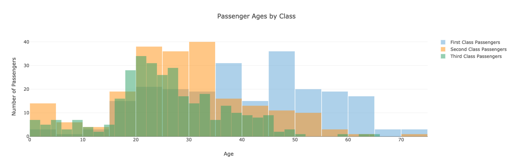
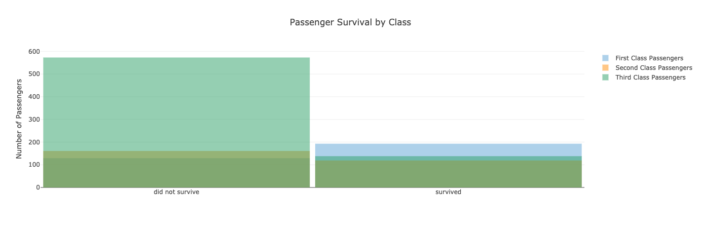
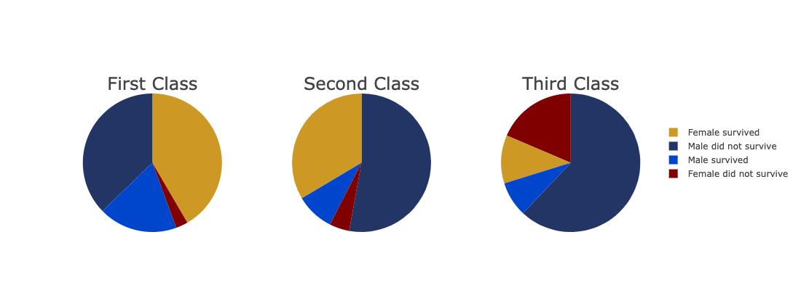
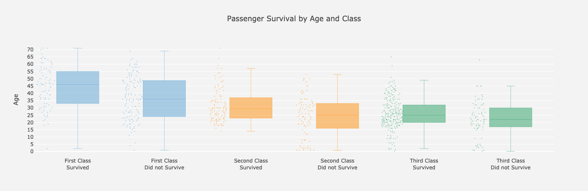

# Titanic Full Stack App

>  Build a full-stack app and deploy it to Heroku


## Table of contents
* [Deployed App](#Deployed-App)
* [Visualizations](#Visualizations)
* [Technologies](#Tasks)
* [Contact](#Contact)

## Deployed App

https://mytitanic-analysis.herokuapp.com/


## Visualizations

Python Flask-powered API with seven routes.

```  
@app.route("/")
@app.route("/age/")
@app.route("/age/<pclass>")
@app.route("/survived/")
@app.route("/survived/<pclass>")
@app.route("/gender-class/")
@app.route("/class-age/")
```

Four plotly javascript visualizations 










## Technologies
- Python
- Flask
- Javascript
- HTML/ CSS
- Bootstrap
- Plotly
- SQLAlchemy
- SQLite
- Heroku

## Contact
Created by [@deepavadakan](https://github.com/)